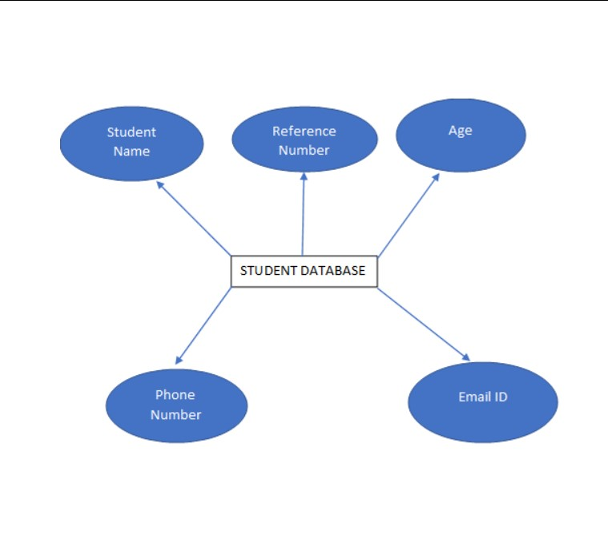
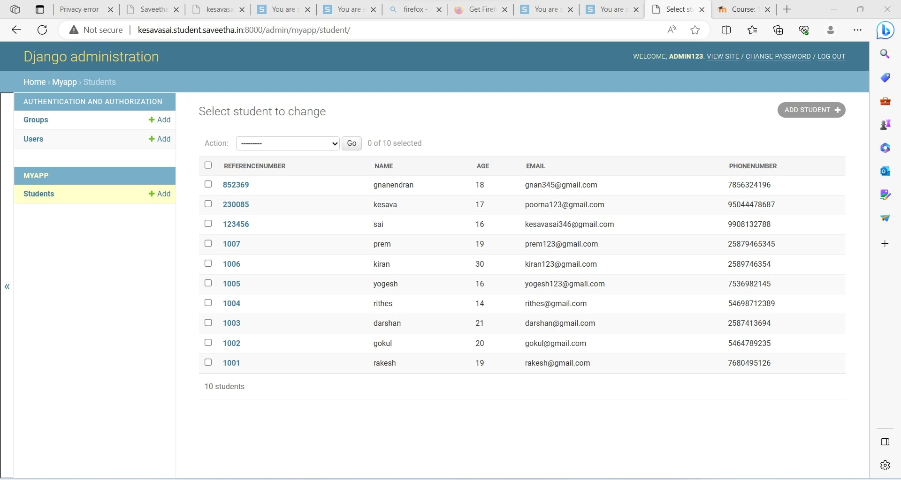

# Django ORM Web Application

## AIM
To develop a Django application to store and retrieve data from a database using Object Relational Mapping(ORM).

## Entity Relationship Diagram

## DESIGN STEPS

### STEP 1: creat folder 'ex02' under the directary 'unit2'

### STEP 2: clone the github repository into the directory 'ex02' using the command "git clone <url>"

### STEP 3:  under the folder "django-orm-app", enter the directory titled "dataproject" and enter the folder "dataproject" and go to the file "setting.py".os" in line 14, set ALLOWED_HOSTS=['*'] and add 'myapp' under the list INSTALLED_APPS.

### STEP 4: Return to the parent folder "dataproject" and install the application myapp using the command "python3 manage.py startapp myapp"

### STEP 5: under the directory "myapp", open "models.py" and enter the code for the coumn headings

### STEP 6: under the directary "myapp", open "admin.py" and enter the code to set up the admin

Write your own steps

## PROGRAM
### models.py:
'''py
from django.db import models
from django.contrib import admin
#creat your modelsr=models.CharField(primary_key=True,max_lenght=20,help_text="referencenumber")
    name=models.CharFiled(max_lenght=100)
    age=models.IntegerFiled()
    email=models.EmailFiled()
    phonenumber=mopdels.IntegerFiled()

    class StudentAdmin(admin.ModelAdmin):
       list_display=('referencenumber','name','age','email','phonenumber')
'''

### admin.py:
'''py
class student (models.Model):
    referencenumbe
from django.contrib import admin
from .models import student,StudentAdmin

# Resister your models here.
admin.site.register(student,StudentAdmin)
'''

## OUTPUT

### STUDENT LIST:

### Error:

## RESULT
The Program is executed successfully.